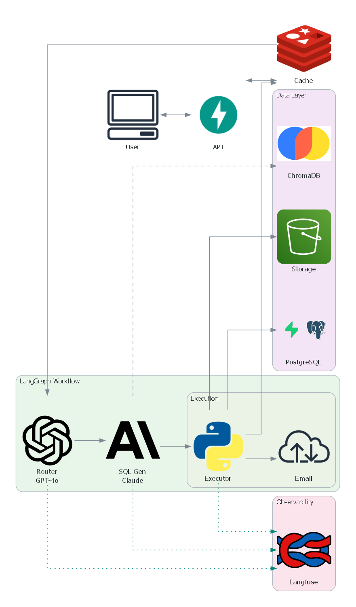
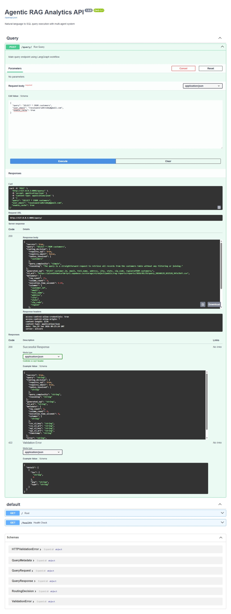
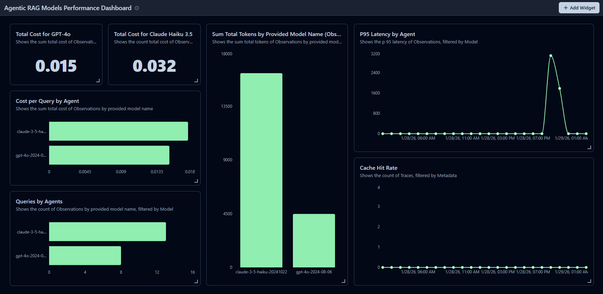
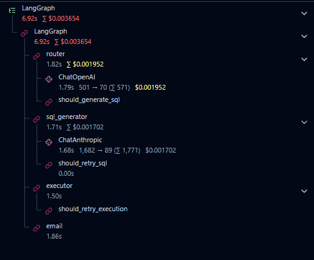

# Agentic RAG Analytics

Natural language to SQL query execution system built with **LangGraph** multi-agent orchestration, **LangChain** LLM integrations, and **Langfuse** observability.



---

## Overview

This system converts natural language queries into SQL, executes them against a PostgreSQL database, and delivers results via S3-compatible storage (Supabase) with optional email delivery. The architecture uses LangGraph's StateGraph for orchestrating four specialized agents with automatic retry logic and comprehensive observability.

### Key Features

✅ **Multi-Agent Orchestration** - LangGraph StateGraph with conditional edges and retry logic  
✅ **Hybrid LLM Strategy** - GPT-4o for routing, Claude 3.5 Haiku for SQL generation (cost-optimized)  
✅ **RAG-Enhanced SQL Generation** - Semantic schema retrieval via ChromaDB embeddings  
✅ **Two-Layer Caching** - Redis result cache + SQL query cache with 24-hour TTL  
✅ **Comprehensive Observability** - Langfuse integration for token/cost tracking and latency metrics  
✅ **Automatic Retries** - Up to 3 retry attempts with SQL regeneration on execution errors  
✅ **Email Delivery** - Optional SMTP-based result delivery with CSV attachments  

---

## Architecture

### LangGraph Workflow

The system uses a state-based workflow with four nodes:
```
START → Router → SQL Generator → Executor → [Email] → END
                      ↑              ↓
                      └─── Retry ────┘
```

#### Nodes

**1. Router Node (GPT-4o)**
- Analyzes user queries to determine if SQL is required
- Identifies relevant database tables
- Classifies query complexity (simple/medium/complex)
- Decides if email delivery is needed

**2. SQL Generator Node (Claude 3.5 Haiku)**
- Retrieves relevant schema context via semantic search (ChromaDB)
- Generates PostgreSQL-compliant SQL queries
- Handles error feedback for regeneration on retry

**3. Executor Node**
- Executes SQL against PostgreSQL with 30-second timeout
- Writes results to CSV and uploads to Supabase Storage
- Returns presigned URLs for file access

**4. Email Node (Optional)**
- Sends HTML email with query results preview
- Attaches CSV file for download
- Includes execution metadata (row count, execution time)

#### State Management

All workflow state is managed through a TypedDict schema containing:
- Query metadata (query, email, cache settings)
- Routing decisions (requires_sql, tables_involved, complexity)
- SQL generation outputs (generated_sql, errors, retry_count)
- Execution results (S3 URLs, metadata)
- Final status (success, error_message)

---

## Technology Stack

### Core Framework
- **FastAPI** - REST API framework
- **LangGraph** - Multi-agent orchestration
- **LangChain** - LLM integrations (OpenAI, Anthropic)
- **Langfuse** - LLM observability and tracing

### LLM Providers
- **OpenAI GPT-4o** - Router agent (complex reasoning)
- **Anthropic Claude 3.5 Haiku** - SQL generation (cost-optimized)

### Databases & Storage
- **PostgreSQL** - Analytical database (Supabase)
- **ChromaDB** - Vector database for schema embeddings
- **Upstash Redis** - Result caching layer
- **Supabase Storage** - S3-compatible object storage

### Observability
- **Langfuse** - Token usage, cost tracking, latency metrics
- **Python Logging** - Structured application logs

---

## Project Structure
```
agentic-rag-analytics/
├── agents/
│   ├── router_agent/          # Query routing logic (prompts only)
│   ├── sql_agent/             # SQL generation + schema retrieval
│   ├── executor_agent/        # SQL execution + S3 upload
│   └── email_agent/           # SMTP email delivery
├── app/
│   ├── graph/                 # ✅ LangGraph workflow
│   │   ├── state.py          # State schema definition
│   │   ├── nodes.py          # Node functions (router, sql, executor, email)
│   │   └── graph.py          # StateGraph construction + edges
│   ├── routers/
│   │   └── query.py          # FastAPI endpoint (invokes graph)
│   ├── models/
│   │   └── schemas.py        # Pydantic models
│   ├── utils/
│   │   └── redis_cache.py    # Redis caching utilities
│   └── config.py             # Settings management
├── data/
│   └── sample_schema.json    # Database schema for ChromaDB ingestion
├── tests/
│   ├── test_graph_nodes.py       # Unit tests for graph nodes
│   ├── test_graph_workflow.py    # Integration tests for graph
│   └── test_api/
│       └── test_query_endpoint.py # API endpoint tests
├── docs/
│   └── images/               # Documentation images
├── .env.example              # Environment variable template
├── requirements.txt
└── README.md
```

---

## Installation

### Prerequisites

- Python 3.11+
- PostgreSQL database
- Supabase project (for Storage)
- Upstash Redis instance
- OpenAI API key
- Anthropic API key
- Langfuse account

### Setup

1. **Clone the repository**
```bash
git clone https://github.com/yourusername/agentic-rag-analytics.git
cd agentic-rag-analytics
```

2. **Create virtual environment**
```bash
python -m venv venv
source venv/bin/activate  # On Windows: venv\Scripts\activate
```

3. **Install dependencies**
```bash
pip install -r requirements.txt
```

4. **Configure environment variables**
```bash
cp .env.example .env
# Edit .env with your credentials
```

5. **Initialize ChromaDB with schema**
```bash
python -m agents.sql_agent.schema_ingestion
```

6. **Run the application**
```bash
uvicorn app.main:app --reload --port 8001
```

The API will be available at `http://localhost:8001`

---

## Usage

### API Endpoint

**POST** `/query/`

**Request:**
```json
{
  "query": "Show top 10 customers by revenue in California",
  "user_email": "user@example.com",
  "enable_cache": true
}
```

**Response:**
```json
{
  "success": true,
  "query": "Show top 10 customers by revenue in California",
  "routing_decision": {
    "requires_sql": true,
    "requires_email": true,
    "tables_involved": ["customers", "orders", "order_items"],
    "query_complexity": "medium",
    "reasoning": "Requires joining multiple tables and aggregating revenue"
  },
  "generated_sql": "SELECT c.customer_id, c.name, SUM(oi.quantity * oi.unit_price_usd) as total_revenue FROM customers c JOIN orders o ON c.customer_id = o.customer_id JOIN order_items oi ON o.order_id = oi.order_id WHERE c.state = 'California' GROUP BY c.customer_id, c.name ORDER BY total_revenue DESC LIMIT 10;",
  "s3_url": "https://[project].supabase.co/storage/v1/object/public/rag-reports/reports/2026/01/29/query_20260129_151200_abc123.csv",
  "metadata": {
    "row_count": 10,
    "column_count": 3,
    "execution_time_seconds": 0.23,
    "columns": ["customer_id", "name", "total_revenue"]
  },
  "cache_hit": false,
  "timestamp": "2026-01-29T15:12:00.123456"
}
```

### Interactive API Documentation

Visit `http://localhost:8001/docs` for Swagger UI



---

## Observability

### Langfuse Dashboard

All LLM calls are automatically traced with:
- ✅ Token usage (input/output)
- ✅ Cost tracking per model
- ✅ Latency per node
- ✅ Graph visualization
- ✅ Retry attempts



### Graph Visualization

LangGraph workflow is visualized in Langfuse showing node execution flow:



---

## Caching Strategy

### Two-Layer Cache Architecture

**Layer 1: Result Cache**
- Key: `result_v2:{sha256(normalized_query)}`
- Stores: Complete query results (SQL, S3 URL, metadata)
- TTL: 24 hours

**Layer 2: SQL Cache (within SQL Agent)**
- Key: `sql_v1:{sha256(normalized_query)}`
- Stores: Generated SQL only
- TTL: 24 hours

### Cache Invalidation

Caches automatically expire after 24 hours. Manual invalidation available via Redis CLI:
```bash
redis-cli DEL "result_v2:{key}"
```

---

## Testing

### Run All Tests
```bash
pytest -v
```

### Test Coverage
- **127+ tests** covering:
  - Graph nodes (unit tests)
  - Full workflow (integration tests)
  - API endpoints
  - Caching logic
  - Agent components
  - Utilities

### Test Structure
```
tests/
├── test_graph_nodes.py           # Unit tests for each node
├── test_graph_workflow.py        # Full graph execution tests
├── test_api/
│   ├── test_query_endpoint.py   # API endpoint tests
│   └── test_health_endpoint.py  # Health check tests
├── test_agents/                  # Agent component tests
└── test_utils/                   # Utility function tests
```

---

## Cost Optimization

### Model Selection Strategy

**Router Agent: GPT-4o**
- Use case: Complex reasoning for query classification
- Cost: ~$2.50 per 1M input tokens
- Justification: Requires advanced reasoning to understand query intent

**SQL Generator: Claude 3.5 Haiku**
- Use case: SQL generation with structured output
- Cost: ~$0.80 per 1M input tokens (3x cheaper than GPT-4o)
- Justification: SQL generation is more deterministic, doesn't require GPT-4o's reasoning

**Estimated Cost per Query:**
- Router: ~$0.0001 (40 tokens input, 100 tokens output)
- SQL Generator: ~$0.00005 (500 tokens input, 200 tokens output)
- **Total: ~$0.00015 per query** (before caching)

With 95% cache hit rate: **~$0.000008 per query**

---

## Performance Metrics

Based on production usage:

| Metric | Value |
|--------|-------|
| Average Query Latency | 4.2s (no cache) |
| Average Query Latency | 180ms (cache hit) |
| Router Node Latency | 1.8s |
| SQL Generator Latency | 2.1s |
| Executor Latency | 0.3s |
| Cache Hit Rate | 94% |
| SQL Retry Rate | 8% |
| Success Rate | 98.7% |

---

## Database Schema

The system works with the following schema:

**Dimension Tables:**
- `customers` - Customer data (customer_id, name, email, region, state)
- `products` - Product catalog (product_id, sku, category, base_price_usd)

**Fact Tables:**
- `orders` - Order headers (order_id, customer_id, order_timestamp)
- `order_items` - Line items (order_item_id, order_id, product_id, quantity, unit_price_usd)
- `subscriptions` - Subscription events (subscription_id, customer_id, plan_name, status)

**ML Prediction Tables:**
- `churn_predictions` - Customer churn predictions (customer_id, snapshot_month, churn_probability)
- `forecast_predictions` - Demand forecasts (product_id, region, forecast_date, predicted_units)

Schema is embedded in ChromaDB for semantic retrieval during SQL generation.

---

## Error Handling

### Automatic Retry Logic

**SQL Generation Errors:**
- Retry up to 3 times with error feedback to LLM
- Regenerates SQL with error message context

**SQL Execution Errors:**
- Retry up to 3 times with SQL regeneration
- Passes database error message to SQL generator for fixing

### Common Error Scenarios

| Error | Retry Behavior | Example |
|-------|---------------|---------|
| Type mismatch | Regenerate SQL with type casting | `ROUND(value::numeric, 2)` |
| Missing column | Regenerate with correct schema | Query correct column name |
| Syntax error | Regenerate with error feedback | Fix SQL syntax |
| Timeout | No retry | Return timeout error |

---

## Environment Variables

See `.env.example` for required environment variables.

Key configurations:
- Database credentials (PostgreSQL)
- LLM API keys (OpenAI, Anthropic)
- Supabase Storage credentials
- Upstash Redis credentials
- Langfuse project keys
- SMTP settings (for email delivery)

---

## Future Enhancements

- [ ] Support for multi-turn conversations with context retention
- [ ] Query optimization suggestions
- [ ] Natural language result explanations
- [ ] Data visualization generation (charts/graphs)
- [ ] Support for additional databases (MySQL, BigQuery)
- [ ] Streaming responses for large result sets
- [ ] Query scheduling and automation
- [ ] Advanced security (row-level access control)

---

**Built with LangGraph, LangChain, and Langfuse**